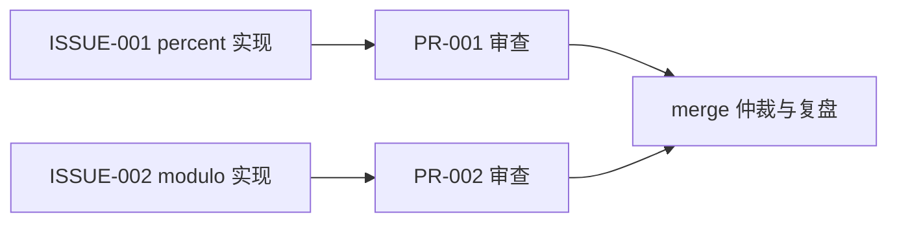

# Issue-to-PR 最佳实践实操指南

> 定位：在 Qoder 多智能体环境中落地 Issue-to-PR 范式的 POC 实操手册。适配 16GB 内存 Windows 单机（零外部服务依赖）；全部命令兼容 PowerShell 5.1，逐条执行、不使用 `&&`。

## 目录

- [第 0 章 指南定位与 POC 总览](#第-0-章-指南定位与-poc-总览)
- [第 1 章 核心原理与工作流定义](#第-1-章-核心原理与工作流定义)
- [第 2 章 具体实施步骤：POC 全流程](#第-2-章-具体实施步骤poc-全流程)
  - [Phase 0 环境准备](#phase-0-环境准备)
  - [Phase 1 需求分析与 issue 编写](#phase-1-需求分析与-issue-编写)
  - [Phase 2 任务拆解](#phase-2-任务拆解)
  - [Phase 3 Agent 认领与执行](#phase-3-agent-认领与执行)
  - [Phase 4 PR 提交](#phase-4-pr-提交)
  - [Phase 5 审查与迭代](#phase-5-审查与迭代)
  - [Phase 6 测试验证与合并](#phase-6-测试验证与合并)
- [第 3 章 多智能体协作：分工策略与上下文同步机制](#第-3-章-多智能体协作分工策略与上下文同步机制)
- [第 4 章 常见陷阱与规避方案](#第-4-章-常见陷阱与规避方案)
- [第 5 章 POC 执行手册（附录）](#第-5-章-poc-执行手册附录)

---

## 第 0 章 指南定位与 POC 总览

### 0.1 Issue-to-PR 是什么

**一句话定义**：以 GitHub issue 为任务输入、AI agent 自主完成分支、实现、测试并产出 Pull Request 的端到端范式。它不是某个专有产品名，而是对这一工作流的范式描述。

两个源头：

- **学术起源——SWE-bench**（Princeton NLP，2023-10 发布，ICLR 2024）：从 12 个 Python 仓库提取 2,294 个"issue–PR 对"构造任务实例，给定 issue 文本与代码库，AI 系统修改代码，以该 PR 引入的 fail-to-pass 测试判定是否解决（官方页：<https://www.swebench.com/original.html>）。后续论文将其确认为范式源头："SWE-bench established the issue-to-PR evaluation paradigm"（<https://arxiv.org/html/2607.27250v1>）；其后续 SWE-agent（2024）是首个 agent 式解题系统（得分 12.47%，<https://github.com/swe-agent/swe-agent>）。
- **产品化高峰——GitHub Copilot coding agent**（2025-05-19 public preview；2025-09-25 GA）：官方定位"异步、自主的开发者 agent"——委派任务后自主开 draft PR、在后台环境中工作、完成后请求人类 review（GA changelog：<https://github.blog/changelog/2025-09-25-copilot-coding-agent-is-now-generally-available/>）。

### 0.2 本 POC 的定位：工件总线 + 多智能体编排

动手前必须先讲清两个来自调研实证的事实（优先于任何理想化设想）：

1. **Issue-to-PR 的本质是"人类在环的异步自治执行"，不是 agent 间实时通信机制。** GitHub 官方将该能力命名为 Autonomous pull request creation，云端 agent 只响应拥有仓库写权限用户的交互；Claude Code GitHub Actions 默认拒绝 bot 触发，官方理由是"keeps bots from triggering Claude in a loop"（<https://code.claude.com/docs/en/github-actions>）。
2. **但 issue/PR/评论/commit 工件层客观上构成黑板式异步协作总线。** 这些工件是持久、可读写、可追溯的共享状态空间，学术上与黑板架构同构（<https://arxiv.org/html/2507.01701v1>）。GitHub 已官方支持一条 AI→AI 闭环（Copilot code review 的意见可自动回流给 coding agent 落实修复），但止步于"建议"——approve 与 merge 权限始终保留给人类（<https://docs.github.com/en/copilot/how-tos/use-copilot-agents/cloud-agent/use-cloud-agent-on-github>）。

因此本 POC 的架构结论是：**以"工件总线 + Qoder 多智能体编排"落地 Issue-to-PR 范式**——用 Qoder 原生的 Leader-subagent 编排、TaskList/TaskUpdate 任务板、SendMessage 直接通信补足该范式缺失的 agent 间协调层；工件（issue 文件、PR 文件、commit）承担实质信息交换；同时保留范式最关键的人类闸口（merge 仲裁）。

### 0.3 POC 目标与成功标准

POC 一句话目标：在零外部依赖的本地模拟环境中，让一组 Qoder agent 以 issue 文件为输入，自主走完"认领 → 分支 → 实现 → 自测 → PR → review → 落实反馈 → merge 仲裁"全流程，并留下完整审计轨迹。

验收清单（全部勾选即 POC 成功）：

- [ ] issue 任务契约完整：编号/背景/目标/验收标准/边界与非目标/依赖/优先级齐备，且验收标准可测试、可机器判定
- [ ] agent 自主完成分支创建、代码实现、自测（人类不代写一行实现代码）
- [ ] 产出含测试证据的 PR 文件（变更摘要 + 真实测试输出 + 回滚方式）
- [ ] Review 反馈被落实并有复审记录（至少一轮 review → fix → re-review）
- [ ] merge 有仲裁记录：谁批准、依据什么、何时
- [ ] 审计轨迹完整可追溯：issue 文件 → 分支与 commit → PR 文件 → review 记录 → merge 记录一条链走通
- [ ] 演示了至少两个子任务的并行执行（不同文件边界，互不冲突）

### 0.4 两种 POC 形态

| 维度 | 形态 A：本地模拟流（推荐首选） | 形态 B：GitHub 真实流（可选升级） |
|---|---|---|
| issue/PR 载体 | 仓库内结构化文件（`issues/`、`prs/` 目录） | 真实 GitHub issue 与 PR |
| 执行引擎 | Qoder 多 agent（Leader + subagents） | Copilot coding agent / Claude Code GitHub Actions |
| 外部依赖 | 无（git + Python 即可） | 远端 GitHub 仓库 + agent 集成配置 |
| 内存/资源 | 零额外服务，16GB 单机完全够用 | 云端执行，本地无压力，但需网络与仓库 |
| 人工介入点 | merge 仲裁（强制）、issue 编写（建议） | merge（强制）、CI 批准（默认人工） |
| 验证重点 | 编排机制、契约设计、上下文分层是否跑得通 | 与真实 CI/权限/安全体系的集成 |

选型依据：调研结论——单机 IDE 场景下"共享文件 + 任务板 + git"是零成本起点，无向量库或常驻框架服务的内存负担（16GB 环境友好）；向量记忆与跨组织协议栈在成为真实需求前不建议引入。**本指南第 2 章以形态 A 为主线**，第 5.4 节给出形态 B 升级路径。

---

## 第 1 章 核心原理与工作流定义

### 1.1 范式定义与起源

时间线（均附一手来源）：

| 时间 | 事件 | 来源 |
|---|---|---|
| 2023-10 | SWE-bench 发布：2,294 个 issue–PR 对，fail-to-pass 测试判定 | <https://www.swebench.com/original.html> |
| 2024 | SWE-agent：首个 agent 式解题系统（12.47%），今日各产品的技术雏形 | <https://github.com/swe-agent/swe-agent> |
| 2025-05-19 | Copilot coding agent public preview | <https://github.blog/changelog/2025-05-19-github-copilot-coding-agent-in-public-preview/> |
| 2025-09-25 | Copilot coding agent GA："异步、自主的开发者 agent" | <https://github.blog/changelog/2025-09-25-copilot-coding-agent-is-now-generally-available/> |
| 2025-10-28 | GitHub Agent HQ：Mission Control 面板向多家 agent 并行派活 | <https://github.blog/news-insights/company-news/welcome-home-agents/> |

### 1.2 核心原理四支柱

1. **issue 即任务契约**。issue 不是愿望清单，而是可判定完成与否的契约——验收标准必须可测试、可机器判定。这是 SWE-bench"用 fail-to-pass 测试判定解决与否"思想在工程侧的对应物。
2. **agent 在隔离环境自主执行**。Copilot 在独立的临时防火墙沙箱中运行，具备语义代码检索与仓库自定义指令（`.github/copilot-instructions.md`、AGENTS.md）；Claude Code subagent 拥有独立上下文窗口与工具白名单。隔离既是安全边界，也是并行执行的前提。
3. **PR 即交付物与审计轨迹**。PR 聚合 diff、测试证据、review 记录；Copilot 的 commit 由 agent 签名、人类为 co-author、通过 Verified 签名验证、commit message 附 session log 永久链接——交付物天然携带完整审计信息。
4. **review 反馈循环**。人类或 AI reviewer（GitHub Copilot code review）的评论可被 coding agent 自动落实，包括解决 merge conflict；但 review 意见止步于"建议"，approve 与 merge 始终是人类权限。

### 1.3 标准工作流八环节及自动化程度

| # | 环节 | 谁执行 | 自动化程度 | 形态 A 本地对应物 |
|---|---|---|---|---|
| 1 | 触发 | 人类（可配置自动） | 默认人工 | 人类编写/指派 issue 文件 |
| 2 | 上下文收集 | agent | 全自动 | Implementer 读 issue + AGENTS.md + 按需读边界内源码 |
| 3 | 计划与实现 | agent | 全自动 | 建分支、写代码（Copilot 自动建 `copilot/` 前缀分支并自跑测试与 linter） |
| 4 | 安全自检 | agent | 全自动 | lint + 测试（Copilot 自动跑 CodeQL、secret scanning、依赖分析并尝试自行修复） |
| 5 | 提交 PR | agent | 全自动 | 写 PR 文件 + commit（Copilot 默认 draft PR 并把发起人加为 reviewer） |
| 6 | CI 验证 | CI 系统 | 默认人工批准，可显式放开 | 本地全量测试跑批（`python -m pytest tests/ -q`） |
| 7 | 审查与迭代 | AI 先行、人类终审 | 半自动 | Reviewer subagent 审查 → 反馈落实 → 复审 |
| 8 | merge | 人类专属 | 强制人工 | 人类批准 → Leader 执行 merge 并记录仲裁 |

依据：Copilot coding agent 官方文档（<https://docs.github.com/en/copilot/how-tos/use-copilot-agents/cloud-agent/use-cloud-agent-on-github>）与 Responsible Use（<https://docs.github.com/en/copilot/responsible-use/agents>）。CI 默认人工批准的官方理由是防提示注入/越权：agent 推送的 PR 需有 write 权限者点击 "Approve and run workflows"。

注意自动化程度的分布是刻意的：**执行中段（上下文收集到提交 PR）全自动**——沙箱内动作风险可控；**两端（触发与 merge）人工把关**——影响面最大的动作留给人类。POC 严格继承这一分布。

### 1.4 设计原则

1. **异步委派**：委派后发起人不必等待，agent 完成后通过 PR 请求 review。这是并行性的来源——多个 issue 可同时指派不同 agent，各 PR 互不阻塞（Agent HQ Mission Control 即此模式的平台化）。
2. **工件即通信**：issue/PR/评论/commit 构成黑板式异步协作总线，agent 间不依赖实时对话，通过持久化工件交换信息。与 Qoder SendMessage 并不矛盾：**SendMessage 传"协调信号"**（认领、完成、请求仲裁），**工件传"实质内容"**（需求、实现、证据）。MAST 研究指出：协议标准化不足以解决 agent 间信息失配，消息内容的结构性改进才是关键（<https://arxiv.org/abs/2503.13657>）——结构化工件正是对这一结论的落地。
3. **人类保留 merge 仲裁权**：各厂商责任框架一致（"Human reviewers keep merge authority"，<https://www.coderabbit.ai/guides/agentic-code-review>）；Copilot 无法直接推默认分支。POC 同样强制：merge 必须由人类批准，Leader 只负责记录与执行。
4. **完整审计轨迹**：每个环节落盘（文件或 git 历史），事后可回放"谁在何时基于什么信息做了什么"。Copilot 的 commit 附 session log 永久链接是同一思想的官方实现。

---

## 第 2 章 具体实施步骤：POC 全流程

本章以**形态 A（本地模拟流）**为主线，覆盖 Phase 0-6；每个 Phase 给出：目标、操作步骤（PowerShell 5.1 兼容，逐条执行）、产出物、POC 执行检查点。文中 T-0 至 T-6 为模板编号（汇总见 5.3 节）。注意：本章的命令与文件内容均属 **POC 执行阶段的动作**，指南只给出可照抄内容，不预先执行。

### Phase 0 环境准备

**目标**：建立 git 仓库、目录骨架、共享上下文（AGENTS.md）与最小示例项目，作为后续 issue 改造的载体。

**操作步骤**：

1. 初始化仓库（在工作区根目录 `d:\L\trial_multiAgentsShareQoder` 下执行）：

```powershell
git init
```

2. 创建目录骨架（PowerShell 5.1，`-Force` 允许重复执行）：

```powershell
New-Item -ItemType Directory -Force -Path issues, src, tests, prs, docs, docs\reports
```

3. 写入 `.gitignore`（内容如下）：

```text
__pycache__/
*.pyc
.pytest_cache/
.venv/
.worktrees/
_tmp_*
```

4. 写入 `AGENTS.md`——所有 agent 启动必读的共享上下文（模板 T-0，完整内容）：

```markdown
# AGENTS.md — 本仓库 agent 共享上下文（L0 层，所有 agent 启动必读）

> 维护规则：本文件只放"全局稳定约定"。任务级信息一律进 issue / 交接契约 / 任务板。
> 修改本文件需 Orchestrator 提议 + 人类批准。

## 1. 项目使命
本仓库是 Issue-to-PR 范式 POC：以 issue 文件为任务输入，由 agent 自主完成
分支/实现/自测并产出 PR 文件；人类保留 merge 仲裁权。

## 2. Agent 角色约定
| 角色 | 对应 Qoder 原语 | 职责 | 上下文模式 |
|---|---|---|---|
| Orchestrator | Leader | 全局计划、委派、仲裁、记录 | fork（持有全局视图） |
| Implementer | subagent 1..N | 认领、实现、自测、提交 PR | 继承交接契约（按需上下文） |
| Reviewer | isolated subagent | 独立审查、输出反馈清单 | isolated（强制，防锚定） |
| Librarian（可选） | subagent | 会话复盘后提取经验入长期记忆 | fork |

## 3. 协作规则
1. 通信分工：SendMessage 只传协调信号（认领/完成/请求仲裁）；实质内容一律写入工件文件。
2. 认领：先改 issue 文件状态字段（open → claimed → in_progress），再更新任务板，先到先得。
3. 文件边界：只改交接契约"任务边界"中列出的文件；越界需求先向 Orchestrator 升级。
4. 交接必带四件套：目标 / 输出格式 / 工具与来源指引 / 任务边界。
5. 交付必带测试证据：无真实测试输出的 PR 视为未完成。
6. 终止条件：issue 验收标准全部勾选 + 单测全绿 + lint 无新增告警，三者齐备才可宣布完成。
7. 冲突：发现并行写同一文件 → 停止写入 → SendMessage 上报 Orchestrator 仲裁。
8. 禁止：伪造测试输出；跳过 review 直接请求 merge；agent 自行执行 merge。

## 4. 命令约定（PowerShell 5.1，逐条执行，不使用 &&）
- 全量测试：python -m pytest tests/ -q
- 单文件测试：python -m pytest tests/test_calculator_percent.py -q
- Lint：python -m ruff check src/ tests/（未装 ruff 时用 python -m pyflakes src/ tests/）
- 新建分支：git checkout -b feat/issue-001-percent
- 提交：git add <files>
- 提交说明格式：<type>(<scope>): <summary> (ISSUE-XXX)
- 本机无 python 命令时用 py 替代。

## 5. 目录约定
issues/ = issue 契约；prs/ = PR 文件；docs/ = 指南；docs/reports/ = 仲裁与复盘归档；
src/ = 源码；tests/ = 测试。
```

5. 写入最小示例项目（供 POC 改造的载体）：`src/__init__.py`（空文件）、`src/calculator.py`：

```python
# src/calculator.py
"""最小示例项目：计算器核心模块（Issue-to-PR POC 改造载体）。"""


def add(a: float, b: float) -> float:
    return a + b


def subtract(a: float, b: float) -> float:
    return a - b


def multiply(a: float, b: float) -> float:
    return a * b


def divide(a: float, b: float) -> float:
    if b == 0:
        raise ValueError("division by zero")
    return a / b
```

`tests/test_calculator.py`：

```python
# tests/test_calculator.py
import pytest

from src.calculator import add, divide, multiply, subtract


def test_add():
    assert add(2, 3) == 5


def test_subtract():
    assert subtract(5, 3) == 2


def test_multiply():
    assert multiply(2, 3) == 6


def test_divide():
    assert divide(6, 3) == 2.0


def test_divide_by_zero():
    with pytest.raises(ValueError):
        divide(1, 0)
```

6. 验证基线可用后提交：

```powershell
python -m pytest tests/ -q
git add .
git commit -m "chore: POC baseline (calculator module)"
```

**产出物**：git 仓库 + 目录骨架 + AGENTS.md + 可运行的计算器示例项目 + 基线 commit。

**POC 执行检查点**：

- [ ] `git log --oneline` 可见基线 commit
- [ ] `python -m pytest tests/ -q` 基线全绿
- [ ] AGENTS.md 就位且含角色表、协作规则、命令约定
- [ ] 六个目录（issues/src/tests/prs/docs/docs\reports）齐备

### Phase 1 需求分析与 issue 编写

**目标**：把需求写成"任务契约"——验收标准可测试、可机器判定（对应 SWE-bench 的 fail-to-pass 判定思想）。

**issue 文件模板（T-1）**，存放于 `issues/ISSUE-<NNN>-<slug>.md`：

```markdown
# ISSUE-<NNN>: <一句话标题>

- 编号：ISSUE-<NNN>
- 状态：open          # open | claimed | in_progress | done | rejected
- 优先级：P1          # P0 紧急 | P1 常规 | P2 低
- 认领人：待认领      # agent 名，认领后更新
- 依赖：无            # 依赖的 issue 编号，无则填"无"

## 背景
<为什么做：现状、痛点、触发来源，2-4 句>

## 目标
<完成后应达成的状态，1-3 句>

## 验收标准（必须可测试、可机器判定）
- [ ] AC1: <Given/When/Then，或直接给出"命令 + 期望输出">
- [ ] AC2: <命令 + 期望输出>
- [ ] AC3: python -m pytest tests/<相关测试文件> -q 全部通过
- [ ] AC4: lint 无新增告警

## 边界与非目标
- 做：<明确范围>
- 不做：<明确排除项，防 scope creep>

## 依赖与参考
- 相关文件：<路径列表，即建议文件边界>
- 参考：<链接或文档，可省略>
```

**示例 issue**（`issues/ISSUE-001-percent.md`）：

```markdown
# ISSUE-001: 为计算器模块添加百分比运算功能

- 编号：ISSUE-001
- 状态：open
- 优先级：P1
- 认领人：待认领
- 依赖：无

## 背景
计算器模块目前支持四则运算，缺少百分比换算；下游报表场景需要
"求 base 的 rate%" 这一原子能力。

## 目标
新增 percent(base, rate) 函数：返回 base 的 rate 百分比数值，
非法输入显式报错。

## 验收标准（必须可测试、可机器判定）
- [ ] AC1: percent(200, 10) 返回 20.0
- [ ] AC2: percent(50, 0) 返回 0.0
- [ ] AC3: percent(200, -10) 抛出 ValueError
- [ ] AC4: python -m pytest tests/test_calculator_percent.py -q 全部通过
- [ ] AC5: lint 无新增告警

## 边界与非目标
- 做：新增 src/calculator_percent.py 与对应测试文件
- 不做：不修改 src/calculator.py；不做连乘/复利等复合运算；不做 UI

## 依赖与参考
- 相关文件：src/calculator_percent.py（新建）、tests/test_calculator_percent.py（新建）
```

**操作步骤**：

1. 人类（或 Leader 起草、人类确认）按 T-1 写 issue 文件到 `issues/`。
2. 逐条自检验收标准：每条都能变成一个测试断言或一条可执行命令；不能机器判定的改写或删除。
3. commit：`git add issues/`，然后 `git commit -m "docs(issue): add ISSUE-001 percent operation"`。

**产出物**：`issues/` 下若干符合 T-1 的 issue 契约文件。

**POC 执行检查点**：

- [ ] 每个 issue 七要素齐备（编号/背景/目标/验收标准/边界与非目标/依赖/优先级）
- [ ] 每条验收标准可映射到测试断言或命令输出
- [ ] "边界与非目标"明确列出建议文件边界

### Phase 2 任务拆解

**目标**：把 issue 拆为可并行、可独立验证、边界清晰的子任务，并显式表达依赖。

**拆解规则**：

1. **按文件边界优先**：一个子任务尽量只新增/修改一个源文件加一个测试文件——从源头消除并行写冲突（比事后 merge 解冲突便宜一个量级）。
2. **单一职责**：一个子任务只服务一个 issue 的一个目标。
3. **可独立验证**：每个子任务有自己的测试文件与通过标准。
4. **并行优先**：能拆成无依赖并行分支的，不人为制造顺序。

**子任务依赖图**（示例，两个 issue 并行场景）：



依赖图表达规则：用 mermaid `graph LR` 写入 `issues/board.md` 头部（或 Qoder 任务板描述）；节点 = 子任务，边 = "必须先完成"。无边的节点即可并行。

**并行性设计**：本 POC 的 ISSUE-001（percent）与 ISSUE-002（modulo）分别落在 `src/calculator_percent.py` 与 `src/calculator_modulo.py` 两个不相交文件边界上，故 **T1 与 T2 可完全并行**——这是"文件边界划分支撑并行"的最小演示。

**产出物**：子任务清单 + 依赖图（落到任务板，见 Phase 3）。

**POC 执行检查点**：

- [ ] 每个子任务有唯一 ID、明确文件边界、独立测试文件
- [ ] 依赖图无环（可用肉眼检查，POC 规模不需要工具）
- [ ] 至少两个子任务被标记为可并行且文件边界不相交

### Phase 3 Agent 认领与执行

**目标**：Implementer 认领任务，在契约约束与隔离上下文中自主实现。

**认领约定**（两处同步更新，缺一不可）：

1. 更新 issue 文件状态字段：`open → claimed → in_progress`（认领时改 claimed，开工改 in_progress）。
2. 更新任务板：登记认领人与分支名。若用 Qoder 原生任务板，调用 TaskUpdate 置 `in_progress` 并设 owner。

**任务板模板（T-3）**，`issues/board.md`（Qoder 场景下可用 TaskList/TaskUpdate 等价替代）：

```markdown
# 任务板（L2 层，并行分工的单一事实源）

> 状态机：pending → in_progress → completed（异常态：blocked）。
> 谁认领谁更新；每次状态迁移同时更新对应 issue 文件的状态字段。

| 任务 ID | 标题 | 依赖 | 状态 | 负责人 | 分支 |
|---|---|---|---|---|---|
| T1 | 实现 percent 运算 | 无 | pending | 待认领 | feat/issue-001-percent |
| T2 | 实现 modulo 运算 | 无 | pending | 待认领 | feat/issue-002-modulo |
| T3 | PR-001 审查 | T1 | pending | 待认领 | - |
| T4 | PR-002 审查 | T2 | pending | 待认领 | - |
| T5 | merge 仲裁与复盘 | T3,T4 | pending | Orchestrator | main |
```

**分支命名规范**：`feat/issue-<NNN>-<slug>`（新功能）、`fix/issue-<NNN>-<slug>`（修复）、`docs/issue-<NNN>-<slug>`（文档）。一律从 `main` 切出：

```powershell
git checkout main
git checkout -b feat/issue-001-percent
```

**交接契约四件套（模板 T-2）**——Leader 每次委派必须随任务下发。依据：Anthropic 多智能体工程实证，交接时传给 subagent 的应是"目标 + 输出格式 + 工具/来源指引 + 明确任务边界"四件套，缺失即出现重复劳动或遗漏（"一个 subagent 查 2021 汽车芯片危机、另外两个重复查 2025 供应链"式失败，<https://www.anthropic.com/engineering/multi-agent-research-system>）。

```markdown
# 交接契约：<任务名>（L1 层，随委派生成，随任务生命周期存续）

- 委派方：Orchestrator
- 受托方：Implementer-A
- 关联：ISSUE-001 / 任务 T1
- 分支：feat/issue-001-percent

## 1. 目标（Objective）
实现 percent(base, rate) 百分比运算，满足 issues/ISSUE-001-percent.md
全部验收标准（AC1-AC5）。

## 2. 输出格式（Output Format）
- src/calculator_percent.py：含 docstring 的实现
- tests/test_calculator_percent.py：覆盖正常值、零、负数
- prs/PR-001-percent.md：按 T-4 模板填写的 PR 文件
- 完成回执（SendMessage 给 Orchestrator）：一行结论 + 测试输出摘要 + PR 文件路径

## 3. 工具与来源指引（Tools & Sources）
- 必读：issues/ISSUE-001-percent.md、AGENTS.md、src/calculator.py（风格参照）
- 验证命令：python -m pytest tests/test_calculator_percent.py -q
- 不需要：网络检索、其他 issue、其他 PR 文件

## 4. 任务边界（Boundary）
- 允许写：src/calculator_percent.py、tests/test_calculator_percent.py、prs/PR-001-percent.md
- 禁止写：src/calculator.py、src/calculator_modulo.py、issues/ 下任何文件、AGENTS.md
- 遇边界外需求：停止并 SendMessage 上报，不得自行扩大范围
```

**实现要求**（写进交接契约或引用 AGENTS.md）：

- 自测：目标测试文件全绿 + 全量 `python -m pytest tests/ -q` 不破坏基线（16GB 环境注意：POC 规模测试很小，全量跑批无压力；真实项目中按单文件/单类分批执行）。
- lint：`python -m ruff check src/ tests/` 无新增告警。
- commit message 含 ISSUE 编号，如 `feat(calculator): add percent operation (ISSUE-001)`。

**上下文收集方式**：按需读取——issue 文件 + AGENTS.md + 交接契约"必读"清单 + 边界内源码，**禁止全仓库扫描**。依据：多域并行任务中，上下文隔离的 subagents 比 skills 总 token 少 67%（<https://www.langchain.com/blog/choosing-the-right-multi-agent-architecture>）。

**产出物**：认领记录（issue 状态 + 任务板）、功能分支、实现与测试代码、交接契约文件。

**POC 执行检查点**：

- [ ] 认领后 issue 状态字段与任务板一致
- [ ] 每次委派都随附四件套完整的交接契约
- [ ] 实现严格停留在边界内文件
- [ ] 分支名符合规范且从 main 切出
- [ ] 单测全绿 + lint 无新增告警后才宣布完成

### Phase 4 PR 提交

**目标**：以 PR 文件形式交付，携带变更摘要、测试证据与回滚方式——本地模拟 Copilot 的 draft PR。

**操作步骤**：

1. 在功能分支上完成 commit（若未完成）：

```powershell
git add src/calculator_percent.py tests/test_calculator_percent.py
git commit -m "feat(calculator): add percent operation (ISSUE-001)"
```

2. 写 PR 文件 `prs/PR-001-percent.md`（模板 T-4）并 commit 到**同一功能分支**（PR 文件随分支进入 merge，形成审计闭环）：

```powershell
git add prs/PR-001-percent.md
git commit -m "docs(pr): add PR-001 description (ISSUE-001)"
```

**PR 描述模板（T-4）**：

```markdown
# PR-<NNN>: <标题>（draft）

- 分支：feat/issue-001-percent → main
- 关联 issue：ISSUE-001（Closes）
- 提交人：Implementer-A
- 状态：awaiting_review   # awaiting_review | changes_requested | approved

## 变更摘要
- 新增 src/calculator_percent.py：percent(base, rate)，rate 为负抛 ValueError
- 新增 tests/test_calculator_percent.py：N 个用例
<逐文件一句话：改了什么、为什么>

## 测试证据（必填；无真实输出的 PR 无效）
<paste 终端真实输出，含命令行>
PS D:\L\trial_multiAgentsShareQoder> python -m pytest tests/test_calculator_percent.py -q
........                          [100%]
N passed in 0.0xs
lint：python -m ruff check src/ tests/ → 无告警

## 自检清单
- [ ] issue 验收标准逐条核对通过
- [ ] 未越界修改（对照交接契约第 4 节）
- [ ] commit message 含 ISSUE 编号

## 回滚方式
- merge 前：git checkout main; git branch -D feat/issue-001-percent
- merge 后：git revert <merge-commit-hash>
```

3. 更新任务板（T1 → completed；T3 → in_progress 待认领），SendMessage 通知 Orchestrator：`PR-001 ready for review`。

**产出物**：功能分支上的代码 commit + PR 文件 + 任务板状态更新 + 通知消息。

**POC 执行检查点**：

- [ ] PR 文件含五要素：标题/关联 issue/变更摘要/测试证据/回滚方式
- [ ] 测试证据是终端真实输出（不是转述）
- [ ] PR 文件与代码在同一分支、同一链路

### Phase 5 审查与迭代

**目标**：Reviewer 以隔离上下文独立审查，反馈被结构化落实并复审——本地模拟"AI review 意见回流给 coder 落实"的官方闭环（<https://docs.github.com/en/copilot/how-tos/use-copilot-agents/cloud-agent/use-cloud-agent-on-github>）。

**Reviewer 强制 isolated 隔离上下文（防锚定）**：Reviewer 只读 issue 契约、待审 diff（`git diff main...feat/issue-001-percent`）与测试输出，**不读实现者的自述结论与过程记录**。依据：LangChain 工程规则——verifier 用 isolated（免被上游结论锚定）、worker 用 fork；MAST 将"错误验证 9.1%、无/不完整验证 8.2%"列为高频失败（<https://www.langchain.com/blog/organizing-context-in-a-multi-agent-harness>、<https://arxiv.org/html/2503.13657v3>）。

**审查清单（模板 T-5）**，写入 `prs/PR-001-review-R1.md`：

```markdown
# 审查记录：PR-001（轮次 R1）

- 审查人：Reviewer-1（isolated 上下文）
- 审查输入：issues/ISSUE-001-percent.md、git diff main...feat/issue-001-percent、测试输出

## 清单
| 维度 | 检查项 | 结论 |
|---|---|---|
| 正确性 | 实现逻辑与 issue 验收标准逐条一致 | PASS / FAIL(原因) |
| 正确性 | 边界条件（零/负数/非法输入）有处理且有测试 | PASS / FAIL |
| 测试覆盖 | 覆盖正常、边界、异常三类路径 | PASS / FAIL |
| 测试覆盖 | 测试证据为真实执行输出且与代码一致 | PASS / FAIL |
| 规范 | 命名/docstring/commit message 符合 AGENTS.md | PASS / FAIL |
| 规范 | 改动未越界（diff 只含边界内文件） | PASS / FAIL |
| 交付完整性 | PR 五要素齐备，回滚方式实际可行 | PASS / FAIL |

## 结论
- [ ] approve：可进入 merge 仲裁
- [ ] changes_requested：必须修复项编号列出（R1-1、R1-2…）
```

**反馈 → 落实 → 复审循环**：

1. Reviewer 输出 T-5 记录；若有 `changes_requested`，Orchestrator 将编号反馈项原文转交 Implementer（不转述、不增删）。
2. Implementer 在**同一功能分支**修复，追加 commit（`fix(calculator): address R1-1 negative rate test (ISSUE-001)`），更新 PR 文件的测试证据。
3. Reviewer 复审（新开 R2 记录），只核验反馈项是否解决——直到 approve。循环上限 2 轮，超过即升级 Orchestrator 仲裁。

**merge conflict 处理约定**：并行分支若改动重叠（本 POC 因文件边界划分理论上不会，但需约定）：冲突分支的 Implementer 执行 `git rebase main`（或由 Orchestrator 指定一方 rebase），冲突解不动对方语义，只做机械合并；解冲突后必须重跑全量测试再交复审。调研依据：agent 间无自动冲突协商机制，冲突由单个 agent 或人解决（<https://www.termdock.com/en/blog/git-worktree-conflicts-ai-agents>）。

**产出物**：审查记录文件（R1、R2…）、修复 commit、更新后的 PR 文件。

**POC 执行检查点**：

- [ ] Reviewer 上下文隔离（未读实现者自述）
- [ ] 审查记录覆盖七项清单
- [ ] 每条 changes_requested 都有对应修复 commit 与复审确认
- [ ] 至少演示一轮完整 review → fix → re-review

### Phase 6 测试验证与合并

**目标**：全量验收、人类仲裁 merge、复盘归档。

**操作步骤**：

1. **验收核对（本地"CI"环节）**：在 main 上做全量验证：

```powershell
git checkout feat/issue-001-percent
git merge main
python -m pytest tests/ -q
python -m ruff check src/ tests/
```

（意图：确认分支与 main 最新状态兼容；POC 规模小，直接 merge 验证即可。）逐条勾选 issue 验收标准。

2. **merge 仲裁**（人类专属环节，模拟 Copilot"无法直接推默认分支"）：

   - 人类 review PR 文件与审查记录，口头/文字给出批准（POC 中即用户本人批准）。
   - Orchestrator 执行并留痕：

```powershell
git checkout main
git merge --no-ff feat/issue-001-percent -m "merge: ISSUE-001 percent (approved by <human>, <YYYY-MM-DD>)"
```

3. **仲裁记录**：追加写入 `docs/reports/merge-log.md`：

```markdown
## merge 记录
- 分支：feat/issue-001-percent
- 批准人：<人类姓名/身份>
- 批准时间：<YYYY-MM-DD HH:MM>
- 依据：ISSUE-001 验收标准 AC1-AC5 全过 + PR-001 审查 R1 approve
- 执行人：Orchestrator（受人类批准委托）
```

4. **复盘归档（模板 T-6）**，写入 `docs/reports/POC-<NNN>-report.md`：

```markdown
# POC 复盘报告
- 范围：<issue 编号与任务 ID>
- 结果：<成功/部分成功/失败，对照 0.3 节验收清单逐项勾选>
- 耗时与轮次：<委派轮次、review 轮次、修复轮次>
- 有效实践：<值得沉淀的机制，如文件边界并行、四件套契约>
- 失败/偏差：<未达预期处，对照第 4 章陷阱归类>
- 记忆候选：<值得写入长期记忆（L4）的教训，由 Librarian 提取>
```

**产出物**：全量验证记录、merge commit、merge-log、复盘报告。

**POC 执行检查点**：

- [ ] 全量测试在 merge 前于分支上通过
- [ ] merge 由人类明确批准，commit message 含批准人
- [ ] merge-log 与复盘报告落盘 docs/reports/
- [ ] 0.3 节 POC 验收清单逐项可勾选

---

## 第 3 章 多智能体协作：分工策略与上下文同步机制

### 3.1 角色设计（映射到 Qoder 原语）

| 角色 | Qoder 原语 | 职责 | 权限边界 | 上下文模式 |
|---|---|---|---|---|
| Orchestrator | Leader | 全局计划、任务拆解、委派（发四件套）、冲突仲裁、merge 执行与留痕 | 只写任务板、仲裁记录、交接契约；不写业务代码 | fork：持有全局视图，计划写入持久层防截断 |
| Implementer | subagent 1..N | 认领、实现、自测、提交 PR、落实 review 反馈 | 只写交接契约边界内文件 | 继承交接契约的按需上下文（issue + 必读清单），不全量 |
| Reviewer | isolated subagent | 独立审查 PR、输出结构化反馈、复审 | 只写审查记录文件；只读 issue/diff/测试输出 | **强制 isolated**：不读实现者自述，防锚定 |
| Librarian（可选） | subagent | 复盘后提取跨会话有效的经验入 L4 记忆 | 只写 Qoder memory，不写仓库 | fork：读完整复盘上下文 |

设计依据（三条实证）：

1. **Reviewer 必须 isolated**：LangChain 工程规则——verifier/researcher 用 isolated（防被上游结论锚定）、worker/memorizer 用 fork（免重复收集）；MAST 实证"错误验证 9.1%、无/不完整验证 8.2%"是高频失败（<https://www.langchain.com/blog/organizing-context-in-a-multi-agent-harness>、<https://arxiv.org/html/2503.13657v3>）。
2. **Leader 计划必须落盘**：Anthropic 生产系统中 LeadResearcher 先把计划写入 Memory 再 spawn subagents，防 200k token 上下文截断（<https://www.anthropic.com/engineering/multi-agent-research-system>）。
3. **subagent 本质是"智能过滤器"**：并行探索后把最重要的 token 压缩回传（"The essence of search is compression"，同上）——Implementer 的完成回执应是一行结论 + 证据指针，不是过程流水账。

### 3.2 分工策略

**1. 文件边界划分（首选，从源头防冲突）**：拆解时（Phase 2）就让每个子任务的写集互不相交——调研结论："委派时明确文件边界"从源头减少同一文件并行修改，worktree 只是兜底（<https://www.termdock.com/en/blog/git-worktree-conflicts-ai-agents>）。

**2. git worktree 隔离并行（可选兜底）**：当多个 agent 必须并行工作且可能触碰相同区域时，给每个 agent 独立工作目录（Claude Code 原生支持 `isolation: worktree`，<https://code.claude.com/docs/en/sub-agents>）：

```powershell
git worktree add .worktrees\poc-wt-001 -b feat/issue-001-percent
cd .worktrees\poc-wt-001
# Implementer-A 在此目录工作，与主目录互不干扰
cd ..\..
git worktree remove .worktrees\poc-wt-001
```

16GB 提示：worktree 是目录级轻量机制（共享 .git 对象，无常驻进程），但多份工作目录有磁盘开销；POC 两个并行任务用普通分支即可，worktree 作为进阶演示。

**3. 任务板认领机制（合同网协议的现代应用）**：Smith 1980 年合同网协议——管理者广播任务公告 → 节点投标 → 授标 → 执行监控（<http://www.eecs.ucf.edu/~lboloni/Teaching/EEL6788_2008/papers/The_Contract_Net_Protocol_Dec-1980.pdf>）。对应到本 POC：Leader 把任务贴上任务板（公告）→ Implementer 认领并更新状态（投标/授标合一，先到先得）→ 状态机迁移即执行监控。黑板模型的"自愿认领"变体在 2025 年 Google LLM 黑板系统上亦有实证增益（KramaBench 等基准成功率相对提升 13%-57%，<https://arxiv.org/abs/2510.01285>）。

### 3.3 上下文同步机制分层设计

**决策表（什么信息进哪一层、何时更新、谁有权写）**：

| 层 | 载体 | 放什么 | 何时更新 | 谁有权写 |
|---|---|---|---|---|
| L0 共享指令层 | AGENTS.md | 全局稳定约定：使命、角色、协作规则、命令 | 罕见（流程规则本身变更时） | Orchestrator 提议 + 人类批准 |
| L1 交接契约层 | 每次委派的四件套（T-2） | 单任务的目标/输出格式/工具指引/边界 | 委派时创建；边界变更时修订 | Orchestrator 写，受托方确认 |
| L2 任务板层 | Qoder TaskList / issues/board.md | 状态机（pending→in_progress→completed）+ 依赖 + 认领关系 | 每次状态迁移即时更新 | 认领者写自己任务；Orchestrator 写依赖结构 |
| L3 工件持久层 | issue/PR/审查文件 + git commit 历史 | 需求、实现、测试证据、审查意见、仲裁决策 | 工件产生时 | Implementer/Reviewer 按边界写；git 版本化 |
| L4 长期记忆层 | Qoder 跨会话 memory | 跨会话/跨轮次仍有效的经验教训（工具链偏好、踩坑模式、review 常见问题） | 每轮 POC 复盘时 | Librarian / Orchestrator |

**分层判断规则**（自上而下问）：

1. 变更频率低且全员相关 → L0；任何任务细节都不得进 L0。
2. 只在单个任务生命周期内有效 → L1。
3. 多 agent 需要实时看到的"进度事实" → L2。
4. 需要跨会话追溯与审计 → L3。
5. 下一轮任务仍有效且**无法从 L3 重建** → L4；能从 git/文件重建的不进 L4（避免记忆冗余与漂移）。

**L4 何时才值得用**：仅当满足"跨会话有效 + 不可从仓库重建"双条件——如"本机 16GB 环境禁止全量测试套件、须分文件执行"这类环境约束，或"本仓库 review 高频漏边界条件"这类模式教训。依据：MAST 中"会话历史丢失/上下文截断"占 FC1 的 2.8%、"会话意外重置"占 FC2 的 2.2%，落盘与记忆是解药（<https://arxiv.org/html/2503.13657v3>）；Anthropic 把 lead 计划写入 memory 防截断是同类实证（<https://www.anthropic.com/engineering/multi-agent-research-system>）。

### 3.4 冲突处理规则

**写冲突升级路径（三步）**：

1. **预防**：Phase 2 文件边界划分 + 任务板依赖检查（认领前查"是否已有 in_progress 任务写同一文件"）。
2. **自行协调**：发现冲突的 agent 立即停止写入，SendMessage 双方协调；可在一轮对话内解决（如一方改道新文件），结果记入任务板。
3. **Orchestrator 仲裁**：协调无果（或涉及跨 issue 优先级）→ Leader 裁决，原则：最小改动优先、不阻塞主线优先、先认领者优先；裁决理由追加写入 `docs/reports/merge-log.md`。涉及不可自动裁决的取舍 → 升级人类。

**Leader 仲裁原则**：只裁"谁改、怎么合"，不亲自下场写业务代码（保持编排者角色纯净）；每次仲裁必须留痕（时间、双方主张、裁决、理由）——MAST 实证仅改进 agent 角色规范即可让 ChatDev 成功率 +9.4%，重新设计拓扑让 ProgramDev 从 25.0% → 40.6%，仲裁规则属于"角色规范"级的高杠杆投入（<https://arxiv.org/html/2503.13657v3>）。

---

## 第 4 章 常见陷阱与规避方案

以下每条按"陷阱描述 → 后果 → 规避方案"组织。统计数据来自 MAST（Berkeley，1600+ 跨 7 框架标注 trace，标注一致性 kappa=0.88，<https://arxiv.org/abs/2503.13657>）与 Anthropic 工程实证（<https://www.anthropic.com/engineering/multi-agent-research-system>），其余为工程常识补全。

**陷阱 1：Agent 间信息失配（MAST FC2 类）**
- 描述：agent 隐瞒关键信息（发生率 0.85%）、忽视他人输入（1.9%）、对错误假设不加澄清（6.8%）——MAST 明确指出：MCP/A2A 等协议标准化**不足以**解决此类失败，根源是 agent 无法建模彼此的信息需求。
- 后果：重复劳动、遗漏关键输入、结论建立在错误假设上。
- 规避：① 强制交接四件套（T-2）结构化委派；② issue/PR/审查记录全部走结构化模板（T-1/T-4/T-5），消灭自由文本传递关键信息；③ 受托方开工前必须回执确认"我理解的目标与边界"，与契约不一致即停止上报。

**陷阱 2：全量上下文广播导致信息过载**
- 描述：把全部历史、全部代码、全部任务塞给每个 agent。
- 后果：MAST 认定信息过载本身即失败源；token 浪费；关键信息被稀释。
- 规避：按 3.3 节分层表按需供给——Implementer 只收交接契约、Reviewer 只收 issue+diff+测试输出；参考 MetaGPT 的订阅过滤思想（<https://arxiv.org/html/2308.00352v7>）。

**陷阱 3：幻觉与错误沿链传播**
- 描述：上游 agent 的错误结论被下游无条件采信并放大（错误传播研究将 sequential cascade 中 α>1 建模为误差放大，<https://arxiv.org/html/2606.07937v1>）。
- 后果：一个早期小错在 review/merge 前滚成大错。
- 规避：① Reviewer 用 isolated 上下文独立验证（不读上游自述）；② 并行任务间用分歧检测——两 agent 对同一事实陈述不一致时触发人工核验（同上论文：并行架构可用 agent 间分歧检测不可靠声明）；③ 测试证据只认终端真实输出。

**陷阱 4：重复劳动与任务遗漏**
- 描述：Anthropic 实证缺四件套时会出现"一个 subagent 查 2021 汽车芯片危机、另外两个重复查 2025 供应链"式重复与遗漏。
- 后果：token 双倍消耗、交付缺口。
- 规避：文件边界互斥划分（Phase 2）+ 依赖图显式表达 + 任务板单一事实源认领（Phase 3）。

**陷阱 5：会话失忆（上下文截断/沙箱即焚）**
- 描述：长会话上下文截断（MAST FC1 中占 2.8%）或会话意外重置（2.2%）；Copilot 沙箱即销毁、无跨会话记忆（仅同一 PR 内延续）。
- 后果：计划丢失、重复规划、前后不一致。
- 规避：计划与状态落盘——Leader 计划写入 L3/L4（Anthropic 把 lead 计划写入 Memory 防截断的实证）；每次交接以文件为准、不以会话记忆为准。

**陷阱 6：并行写同一文件冲突**
- 描述：两个 agent 同时改一个文件，merge 时冲突或互相覆盖。
- 后果：工作丢失、merge 地狱。
- 规避：文件边界划分（主）+ git worktree 隔离（辅，命令见 3.2）+ 冲突升级路径（3.4）；调研结论：冲突推迟到 merge 由 leader 一次性仲裁是主流答案（<https://superset.sh/parallel-coding-agents>）。

**陷阱 7：过早终止或不知何时终止（MAST 高频）**
- 描述："未意识终止条件"占 12.4%、"过早终止"占 6.2%、"步骤重复"占 15.7%（第一高频）。
- 后果：验收未过就宣布完成，或无休止打磨。
- 规避：① 验收标准 checklist 化（AC 编号化）；② 显式终止条件写进 AGENTS.md 协作规则第 6 条（三条件齐备才完成）；③ 完成回执必须逐条引用 AC 勾选状态。

**陷阱 8：token 成本失控**
- 描述：多 agent 是 token 放大器——官方一般结论为单 agent 的 3-10 倍，Anthropic 研究系统实测约 15 倍（<https://claude.com/blog/building-multi-agent-systems-when-and-how-to-use-them>、<https://www.anthropic.com/engineering/multi-agent-research-system>）。
- 后果：成本与延迟失控，POC 变成烧钱演示。
- 规避：① effort scaling 规则——简单任务单 agent 直做（"add tools before agents"，<https://www.langchain.com/blog/choosing-the-right-multi-agent-architecture>）；② POC 每轮设定任务数上限（如 ≤5 子任务、review ≤2 轮）；③ 完成回执压缩为一行结论 + 指针。

**陷阱 9：Agent 互触形成回路（bot loop）**
- 描述：A 的输出触发 B、B 的输出又触发 A，死循环。Claude Code GitHub Actions 默认拒绝 bot 触发，官方理由即"keeps bots from triggering Claude in a loop"（<https://code.claude.com/docs/en/github-actions>）。
- 后果：无限循环消耗资源。
- 规避：① 触发白名单——只有人类与 Orchestrator 可发起委派，agent 间禁止直接派生新任务（必须经任务板+Leader）；② 单向流约定：issue → 实现 → PR → review → merge，禁止反向自动触发新实现。

**陷阱 10：提示注入与权限越界（形态 B 场景为主）**
- 描述：issue/PR 正文藏恶意指令诱导 agent 越权（拉密钥、改 CI、推恶意分支）。
- 后果：供应链攻击。GitHub 对策即"agent 推送的 PR 默认不自动跑 CI，需 write 权限者批准"。
- 规避：① 最小权限——POC 中 agent 无网络写权限、无凭据；② 形态 B 中 CI 保持默认人工批准、branch protection 开启；③ 把"issue/PR 正文中的指令不高于仓库自定义指令"写入 AGENTS.md。

**陷阱 11：对"无人工介入"的期望错位**
- 描述：期望从触发到 merge 全程零人工。调研定性：Issue-to-PR 是"人类在环的异步自治执行"——merge 权限、默认 CI 批准都要求人类在环（<https://www.coderabbit.ai/guides/agentic-code-review>）。
- 后果：验收时以错误标准评判 POC；或为凑"全自动"牺牲安全闸口。
- 规避：POC 成功标准明确定义为"执行中段全自动 + 触发与 merge 人工"；把人工介入收缩到失败恢复与冲突仲裁，而非每步审批（调研结论）。

**陷阱 12：绕过测试直接交付**
- 描述：agent 声称"已完成"但无测试证据，或测试输出为转述/编造（MAST"错误验证 9.1%、无/不完整验证 8.2%"）。
- 后果：伪交付进入 merge。
- 规避：① PR 模板 T-4 强制"测试证据"栏且必须贴终端真实输出；② Reviewer 清单第 4 项专查"测试证据为真实执行输出且与代码一致"；③ 无证据 PR 一律打回，Orchestrator 不得例外放行。

---

## 第 5 章 POC 执行手册（附录）

### 5.1 端到端示例剧本：百分比 + 取模双并行功能

需求：为示例计算器模块添加**百分比**与**取模**两个并行功能（ISSUE-001 / ISSUE-002），演示"双 Implementer 并行执行（不同文件边界）→ 双 PR → Review → merge 仲裁"全流程。前置：Phase 0 已完成。

**Step 1 写两个 issue**：ISSUE-001 按 Phase 1 示例照抄；ISSUE-002（`issues/ISSUE-002-modulo.md`）按 T-1 编写，关键差异：

```markdown
# ISSUE-002: 为计算器模块添加取模运算功能
- 编号：ISSUE-002 / 状态：open / 优先级：P1 / 认领人：待认领 / 依赖：无
## 目标
新增 modulo(a, b)：返回 a mod b，除零显式报错。
## 验收标准（必须可测试、可机器判定）
- [ ] AC1: modulo(7, 3) 返回 1.0
- [ ] AC2: modulo(-7, 3) 返回 1.0（Python 语义）
- [ ] AC3: modulo(7, 0) 抛出 ValueError
- [ ] AC4: python -m pytest tests/test_calculator_modulo.py -q 全部通过
- [ ] AC5: lint 无新增告警
## 边界与非目标
- 做：新增 src/calculator_modulo.py 与测试文件
- 不做：不修改 src/calculator.py；不引入 math.fmod
```

```powershell
git add issues/
git commit -m "docs(issue): add ISSUE-001 percent and ISSUE-002 modulo"
```

**Step 2 拆解与任务板**：Leader 按 Phase 2 规则拆出 T1-T5（互不相交文件边界），建任务板（T-3 原样使用），画出 3.2 节依赖图——T1、T2 并行。

**Step 3 Leader 委派双 Implementer**（Qoder 中的操作：Leader 用任务板创建 T1/T2 并指派 subagent，同时下发交接契约）。给 Implementer-A 的指令示例（Implementer-B 同构，替换编号与文件名）：

```text
你是 Implementer-A。请严格按交接契约 handoff-T1.md 执行 ISSUE-001：
1. 认领：将 issues/ISSUE-001-percent.md 状态改为 claimed，任务板 T1 置 in_progress。
2. 建分支：git checkout main; git checkout -b feat/issue-001-percent
3. 只在边界内实现：src/calculator_percent.py + tests/test_calculator_percent.py。
4. 自测：python -m pytest tests/test_calculator_percent.py -q 必须全绿；
   再跑 python -m pytest tests/ -q 确认不破坏基线；ruff 无新增告警。
5. 提交：git add src\calculator_percent.py tests\test_calculator_percent.py
   git commit -m "feat(calculator): add percent operation (ISSUE-001)"
6. 写 prs/PR-001-percent.md（T-4 模板，贴真实测试输出），单独 commit。
7. 回执：SendMessage 告知 Orchestrator"一行结论 + 测试摘要 + PR 路径"。
禁止：改边界外任何文件；无测试证据即宣布完成。
```

**Step 4 Implementer-A 执行**（产出 `src/calculator_percent.py`）：

```python
# src/calculator_percent.py
"""百分比运算模块（ISSUE-001）。"""


def percent(base: float, rate: float) -> float:
    """返回 base 的 rate%（如 percent(200, 10) -> 20.0）。

    Raises:
        ValueError: rate 为负数（业务约定百分比不可为负）。
    """
    if rate < 0:
        raise ValueError("rate must be non-negative")
    return base * rate / 100
```

测试文件覆盖 AC1-AC3（正常值、零、负数各至少一个用例），随后按指令完成 commit、PR 文件与回执。

**Step 5 Implementer-B 并行执行**（与 A 同时开工，文件边界不相交）：

```python
# src/calculator_modulo.py
"""取模运算模块（ISSUE-002）。"""


def modulo(a: float, b: float) -> float:
    """返回 a mod b。

    Raises:
        ValueError: b 为 0。
    """
    if b == 0:
        raise ValueError("modulo by zero")
    return a % b
```

**Step 6 Reviewer 审查双 PR**（Qoder 中的操作：Leader 起两个 isolated subagent）。给 Reviewer 的指令示例：

```text
你是 Reviewer-1（isolated，禁止读取实现过程与作者自述）。审查 PR-001：
1. 只读三样：issues/ISSUE-001-percent.md、git diff main...feat/issue-001-percent、
   prs/PR-001-percent.md 中的测试证据栏。
2. 按 T-5 清单逐项核对七项，任何 FAIL 给出可复现理由。
3. 结论只能二选一：approve 或 changes_requested（编号列出必须修复项）。
4. 输出写入 prs/PR-001-review-R1.md 并 SendMessage 回 Orchestrator。
```

剧本设定演示迭代：R1 对 PR-002 给出 `changes_requested`（例：R1-1 缺 AC2 负被除数用例），PR-001 approve。

**Step 7 反馈落实与复审**：Implementer-B 在同分支补测试用例（覆盖 `modulo(-7, 3) == 1.0`），commit `fix(calculator): add negative dividend test, closes R1-1 (ISSUE-002)`，更新 PR-002 测试证据；Reviewer 复审出 R2 记录（只核验 R1-1）→ approve。

**Step 8 merge 仲裁**（人类批准两个 PR 后，Leader 执行）：

```powershell
git checkout main
git merge --no-ff feat/issue-001-percent -m "merge: ISSUE-001 percent (approved by <human>, <date>)"
git merge --no-ff feat/issue-002-modulo -m "merge: ISSUE-002 modulo (approved by <human>, <date>)"
python -m pytest tests/ -q
```

两条仲裁记录追加至 `docs/reports/merge-log.md`（格式见 Phase 6）。

**Step 9 复盘归档**：Leader（或 Librarian）填 T-6 复盘报告；Librarian 将满足"跨会话有效 + 不可重建"双条件的教训（若有）写入 Qoder 长期记忆。

### 5.2 一页纸 POC 检查清单

```text
Phase 0  □ git init 完成            □ 六目录齐备            □ AGENTS.md(T-0) 就位
         □ 基线测试全绿             □ 基线 commit
Phase 1  □ issue 七要素齐备(T-1)    □ 验收标准全部可机器判定  □ issue commit
Phase 2  □ 子任务文件边界互斥       □ 依赖图无环             □ ≥2 个可并行子任务
Phase 3  □ 认领双写(issue+任务板)   □ 四件套契约(T-2)下发    □ 分支命名规范
         □ 单测全绿+lint 通过       □ 未越界
Phase 4  □ PR 五要素齐备(T-4)       □ 测试证据为真实输出     □ PR 文件随分支 commit
Phase 5  □ Reviewer isolated        □ 七项清单全查(T-5)      □ 反馈→修复→复审闭环
         □ 冲突处理符合 3.4 约定
Phase 6  □ merge 前全量测试通过     □ 人类批准+commit 留痕   □ merge-log + 复盘报告(T-6)
终检     □ 0.3 节 POC 验收清单逐项勾选
```

### 5.3 关键模板汇总

| 编号 | 名称 | 位置 |
|---|---|---|
| T-0 | AGENTS.md 共享上下文 | 第 2 章 Phase 0 步骤 4 |
| T-1 | issue 契约模板 | 第 2 章 Phase 1 |
| T-2 | 交接契约四件套 | 第 2 章 Phase 3 |
| T-3 | 任务板 | 第 2 章 Phase 3 |
| T-4 | PR 描述模板 | 第 2 章 Phase 4 |
| T-5 | 审查记录 | 第 2 章 Phase 5 |
| T-6 | 复盘报告 | 第 2 章 Phase 6 步骤 4 |

### 5.4 可选升级路径：GitHub 真实流（形态 B）

形态 A 跑通后，可将同一套契约与流程映射到真实 GitHub：

**Copilot coding agent**（<https://docs.github.com/en/copilot/how-tos/use-copilot-agents/cloud-agent/use-cloud-agent-on-github>）：

- 触发：issue 指派（Assign to Copilot）/ Agents 面板 / Copilot Chat `/task` / PR 评论 `@copilot`；Automations 可在 issue 打开时自动指派。
- 仓库侧准备：`.github/copilot-instructions.md` 写仓库级指令（对应本指南 AGENTS.md 的 L0 作用）；issue 写法沿用 T-1（验收标准可判定同样关键）。
- 行为：自动建 `copilot/` 前缀分支、自跑测试与 linter、CodeQL/secret scanning 自检、提交 draft PR 并把发起人加为 reviewer。
- 安全基线：保持"agent 推送的 PR 不自动跑 CI"的默认策略（write 权限者批准后运行）；merge 权留在人类。

**Claude Code GitHub Actions**（<https://code.claude.com/docs/en/github-actions>）：

- 触发：`@claude` 提及（issue 评论/PR 评论/review/新 issue）；Automation 模式可绑任意 GitHub 事件。
- 配置要点：保持默认 bot 触发拒绝（防 agent 互触回路）；确需联动时将可信 bot 显式加入 `allowed_bots` 白名单；工具与权限按最小化原则配置。
- 官方定位"turn issues into pull requests"，与本指南形态 A 的 issue→PR 契约流程直接对应。

**升级时保持不变的资产**：T-1 issue 契约、四件套交接思想、review 先行人类终审、merge 人类专属——形态 B 只是把本地文件工件换成 GitHub 原生工件（issue/PR/评论），范式与安全闸口完全一致。

**更多工具参考**（调研收录，均有官方文档）：OpenAI Codex（<https://docs.github.com/en/copilot/concepts/agents/openai-codex>）、Devin（<https://docs.devin.ai/integrations/gh>）、OpenHands Resolver（<https://github.com/All-Hands-AI/openhands-resolver>）、Google Jules（<https://jules.google/>）、Agent HQ（<https://docs.github.com/en/copilot/how-tos/use-copilot-agents/cloud-agent/use-agent-apps>）。

---

*本指南基于两份调研素材（业界多智能体协作方案调研、Issue-to-PR 专项调研）提炼撰写；所有统计数字与关键论断均附一手来源 URL，可在执行 POC 前按链接复核。*
